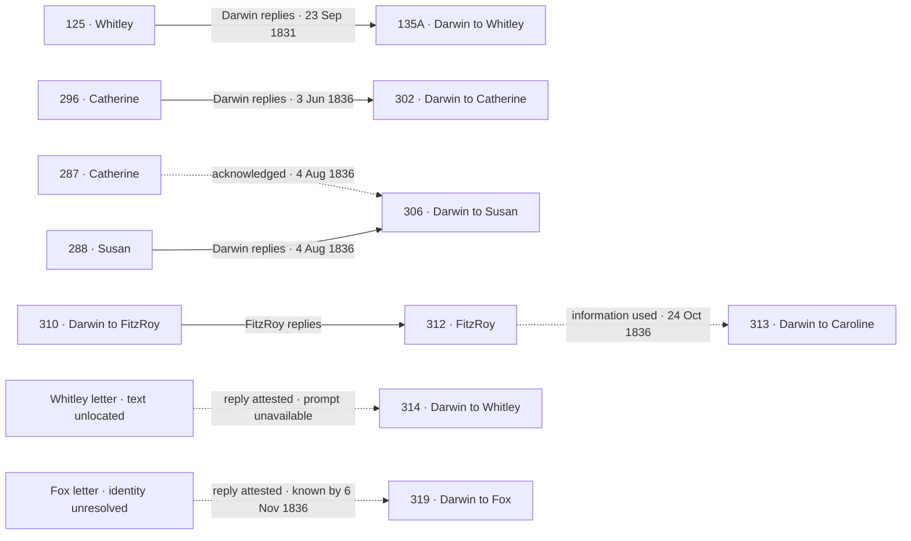

# Darwin correspondence: knowledge, replies, and voice

This is an incremental evidence map. It contains all **288 catalogue records** from the period audit, including the **three held records**, plus **66 attested unlocated or unidentified references**. Reference nodes may alias the same physical letter; two nodes also represent explicitly plural bundles. There are **132 accepted relationships** (61 knowledge links, 54 replies, 15 references to Darwin's own letters, one unread receipt, and one limited event match) and **20 uncertain candidates** kept separately. The reviewed relationships currently give **nine catalogued incoming letters** conservative knowledge dates and **five complete direct prompt–response pairs**. The other **117 incoming records** still have no established full-text availability date. Absence of a link means unreviewed or unresolved, not that no historical relationship existed.

The [pre-Beagle review](../pre-beagle-1828-1831/README.md) adds full review of **80 outgoing and 34 incoming bodies**, following a parent survey with three Luna verifications and parent adjudication. Its three complete prompt pairs are 105 → 107, 125 → 135A (previously established), and 143 → 144. FitzRoy 135 → 139 is also an identified direct reply, but 139's 4-or-11 October alternatives keep it out of automatic prompt pairing. The batch's selected diagram, full dossiers, original proposals and corrected decisions are available in its report.

The [matching method](METHOD.md) describes separate searches for direct replies and information sources, with explicit delivery constraints. The [13-letter post-return review](../post-return-1836/README.md) is complete: all target bodies were read in full, and all 13 remain dated grounding because no complete surviving prompt pair was established in this group. Its generated diagram shows the accepted links and uncertain candidate.

Three Luna reviewers subsequently read all **33 distinct earlier incoming candidates**, assessing **85 incoming/outgoing comparisons**. The [full-reading report](../post-return-1836/incoming-full-read/README.md) preserves their evidence and parent corrections. No new link met the acceptance standard. Three older FitzRoy letters are unlikely prompts for 310 after the intervening voyage and recent days together aboard; old dates remain in the source inventory without being treated as equally plausible inputs. Historical/topic continuity never supplies a knowledge date by itself.

## Search coverage

The expanded body search covers all **286 preserved Darwin-involved records in 37–337**, including suffix entries. It found **896 occurrences of “letter” or “letters” in 231 records**, and **885 additional cues**, for **1,781 hits**. Additional cues include notes, packets, receiving, answering, forwarding, and “heard from.” Headers, salutations, and editorial notes are excluded; the first actual body paragraph is retained.

[letter_references.jsonl](letter_references.jsonl) preserves every hit with exact body-block offsets, nearby prose, original date constraints, author direction, source URL, retrieval metadata, and source hash. Search flags are deliberately broad. A mention may describe an intended, missing, unopened, forwarded, or third-party letter; no hit automatically establishes receipt, a date, or a reply. Incoming writers' acknowledgments date their own knowledge, not Darwin's receipt of the containing letter.

## Reviewed chronology

| Incoming letter | Original writing date | Darwin evidence | Conservative known-by | Conversation role |
| --- | --- | --- | --- | --- |
| [105, Henslow](https://www.darwinproject.ac.uk/letter/?docId=letters/DCP-LETT-105.xml) | 24 August 1831 | [107](https://www.darwinproject.ac.uk/letter/?docId=letters/DCP-LETT-107.xml) | 30 August 1831 | Direct incoming prompt for 107; separately forwarded with 106 |
| [106, Peacock](https://www.darwinproject.ac.uk/letter/?docId=letters/DCP-LETT-106.xml) | [c. 26 August 1831] | [107](https://www.darwinproject.ac.uk/letter/?docId=letters/DCP-LETT-107.xml) | 30 August 1831 | Cross-correspondent offer context; arrival at home differs from Darwin's receipt |
| [125, Whitley](https://www.darwinproject.ac.uk/letter/?docId=letters/DCP-LETT-125.xml) | 13 September 1831 | [135A](https://www.darwinproject.ac.uk/letter/?docId=letters/DCP-LETT-135A.xml) | 23 September 1831 | Direct incoming prompt for 135A |
| [135, FitzRoy](https://www.darwinproject.ac.uk/letter/?docId=letters/DCP-LETT-135.xml) | 23 September 1831 | [138, to Henslow](https://www.darwinproject.ac.uk/letter/?docId=letters/DCP-LETT-138.xml) | 28 September 1831 | Postponement context; later directly answered by uncertainly dated 139 |
| [143, Henslow](https://www.darwinproject.ac.uk/letter/?docId=letters/DCP-LETT-143.xml) | 25 October 1831 | [144](https://www.darwinproject.ac.uk/letter/?docId=letters/DCP-LETT-144.xml) | 30 October 1831 | Direct incoming prompt for 144 |
| [296, Catherine](https://www.darwinproject.ac.uk/letter/?docId=letters/DCP-LETT-296.xml) | 29 January 1836 | [302](https://www.darwinproject.ac.uk/letter/?docId=letters/DCP-LETT-302.xml) | 3 June 1836 | Direct incoming prompt for 302 |
| [287, Catherine](https://www.darwinproject.ac.uk/letter/?docId=letters/DCP-LETT-287.xml) | 30 October 1835 | [306, to Susan](https://www.darwinproject.ac.uk/letter/?docId=letters/DCP-LETT-306.xml) | 4 August 1836 | Acknowledged context; not a direct prompt from Susan |
| [288, Susan](https://www.darwinproject.ac.uk/letter/?docId=letters/DCP-LETT-288.xml) | 22 November 1835 | [306](https://www.darwinproject.ac.uk/letter/?docId=letters/DCP-LETT-306.xml) | 4 August 1836 | Direct incoming prompt for 306 |
| [312, FitzRoy](https://www.darwinproject.ac.uk/letter/?docId=letters/DCP-LETT-312.xml) | [19–]20 October [1836] | [313, to Caroline](https://www.darwinproject.ac.uk/letter/?docId=letters/DCP-LETT-313.xml) | 24 October 1836 | Information used across correspondents; not Caroline's prompt |
| Whitley marriage-news letter, text unlocated | Unknown | [314](https://www.darwinproject.ac.uk/letter/?docId=letters/DCP-LETT-314.xml) | 24 October 1836 | A reply is attested, but no surviving input has been identified |
| Fox letter, identity and text unresolved | Unknown | [319](https://www.darwinproject.ac.uk/letter/?docId=letters/DCP-LETT-319.xml) | 6 November 1836 | An explicit answer, but no surviving input has been identified |

The original dates, including brackets and ranges, remain intact in the map's nodes. Known-by dates come from the reviewed Darwin writing, not catalogue order or presumed postal delay. They are upper bounds on receipt/reading, not delivery dates. For 314, the earlier relative constraint “the day previous to my leaving Shrewsbury” is preserved without assigning a calendar day from a travel plan. Additional missing references appear in the batch dossiers rather than all being repeated in this overview.

Letter 123's explicitly unread Sedgwick letter creates **no** incoming content availability; its identification as 116 is only a candidate. Letter 99 matches the anonymous microscope gift reported in 100, but the note's reading is unproved. A `source_event_match` preserves the gift fact without activating the whole note, and an identity policy keeps Herbert's archival attribution out of young Darwin's knowledge. Henslow 150 answers 147 but remains only a candidate input to 152; an incoming reply is not evidence of Darwin's receipt of it.

This overview shows the principal incoming information links. Solid arrows identify replies; dashed arrows identify knowledge used across correspondents or an unavailable prompt. The [post-return report](../post-return-1836/README.md#reviewed-flow) adds the references to Darwin's own letters and the Herbert history.



### The Whitley search

The complete pinned CSV contains 15,238 records and 12 involving Whitley. Only **125** (1831) and **267** (1835) are incoming. Both bodies were checked. Letter 125 concerns the Beagle appointment and matches 135A; the edition also identifies that pair. In 267, Whitley explicitly says he is neither married nor engaged, making it incompatible with the marriage news answered in 314. Targeted public searches did not locate a matching 1836 incoming text.

We therefore preserve an explicitly marked reference node, `UNLOCATED-WHITLEY-BEFORE-314`, with no fabricated catalogue number, original metadata, date, or letter text. The evidence establishes the letter's existence and Darwin's receipt, not its present location or destruction. Letter 314 remains Darwin grounding until an actual incoming prompt is located. The search case retains all 12 original Whitley metadata rows, rejected identifications, evidence, queries, and limitations.

### Post-return findings

319 explicitly answers Fox, but no particular surviving William Darwin Fox letter among 175, 184, 197, and 261 was established as its input. The Fox reference stays unlocated, with no assumed recent composition date. Harriet Fox's letters are a different author's writing. The plausible reference from 327 back to 319 remains an uncertain candidate, not an accepted identity.

318 refers to the longer letter 317 accompanying the Galapagos plants; 329 refers to the Carlisle letter represented by 330's minute-book report. These document references do not establish new incoming context or recipient receipt. 317 retains its unresolved 30–31 October XML interval and null scalar date; 330 stays excluded from voice.

314 reports an unreceived note left for Herbert at Shrewsbury. Herbert's 323 corroborates that failed handoff while answering a different current Darwin letter. The two outgoing texts are separate unlocated reference nodes. Herbert's receipt is not Darwin's receipt of 323: that incoming record remains unavailable to persona memory pending evidence. The [13 dossiers](../post-return-1836/dossiers.jsonl) preserve these distinctions alongside non-letter advice, future requests, and rejected later inputs.

### FitzRoy and family correspondence

312 is itself a reply to Darwin's 310, acknowledging his happy family reunion. That relationship is recorded, but its answer is FitzRoy's writing. Separately, 313 explicitly references the Captain's retained letter, with the matching bride and December marriage plan. This makes 312 available as attributed context for 313 without turning it into Caroline's input. The fact carried forward is FitzRoy's announced intention, not an accomplished marriage.

The earlier receipt case study grouped Catherine's 287 and Susan's 288 as letters acknowledged and responded to in 306. The new map refines the conversational role: 306 is addressed to Susan. Both incoming letters supply context, but only Susan's is currently established as a direct prompt. The earlier case-study evidence is preserved unchanged.

## Training-role policy

- **Incoming letters:** never Darwin voice targets, whether answered or not. Once availability is established, retain the real speaker and use their information as context; a direct reply can also establish an input prompt.
- **Darwin's own prose:** candidate voice material if sole attribution, a preserved transcription, and period eligibility are supported. A direct reply with an identified input is a response candidate; otherwise retain the agreed dated-grounding role.
- **303 and 330:** excluded from individual Darwin voice. They are respectively a jointly signed conclusion and a reported minute-book text. Three records with possibly later dates remain held.
- **Unknown incoming dates:** never treated as always available. The particular attesting outgoing letter can use the supported incoming context; other events on the same day need separate ordering evidence.
- **Several writing dates:** preserve each section's constraints. An unresolved range does not receive an exact scalar date or an automatic prompt-ready flag.
- **Future training export:** mask incoming/context tokens from the answer loss. Only eligible Darwin output should be the voice target. Do not send incoming prose through a grounding or summarization path that assumes it was authored by Darwin. These requirements are recorded here; no trainer/exporter has been implemented or run.

The 157 outgoing records passing the current metadata/transcription checks remain **provisional** voice candidates, not a claim that every embedded quotation or editorial insertion has been audited. Five have established direct prompts and 152 retain the grounding role. No training records have been exported.

## Files and continued review

- [graph.json](graph.json): nodes, accepted and candidate edges, 93 outgoing review records, original metadata, XML constraints, exact evidence, source hashes, role decisions, Whitley/Fox/Herbert searches, and the earlier body-date and receipt observations.
- [summary.json](summary.json) and [search_summary.json](search_summary.json): coverage and reproducibility counts.
- [Reviewed annotations](../../data/annotations/correspondence_links.json): the editable source of reviewed links. Add evidence here; keep unreviewed keyword matches in the candidate queue.
- [Incoming knowledge dates](../1828-1836/incoming_knowledge_dates.jsonl): all 126 eligible incoming records, now with separate `knowledge_links` and `response_links`.

In JSON, `knowledge_before` points incoming → Darwin writing; `replies_to` points replying letter → earlier letter; `refers_to_own_letter` points Darwin's referring letter → the Darwin document mentioned. None changes authorship. Own-letter references, `receipt_without_reading`, and `source_event_match` never populate incoming full-text availability or prompt fields. `candidate_links` never activate either. A reply edge alone does not make a training pair: actual text, matching participants, voice attribution, period eligibility, and sufficiently resolved timing must also pass.

Rebuild offline with Python 3.11+:

```sh
python3 scripts/search_letter_references.py
python3 scripts/build_pre_beagle_review.py
python3 scripts/build_correspondence_map.py
python3 scripts/build_post_return_review.py
python3 -m unittest discover -s tests -v
```

`scripts/annotate_response_dates.py` now calls the map builder for compatibility, so it cannot overwrite these knowledge-only links with the earlier reply-only interpretation. Source snapshots and the original date audit remain unchanged.
