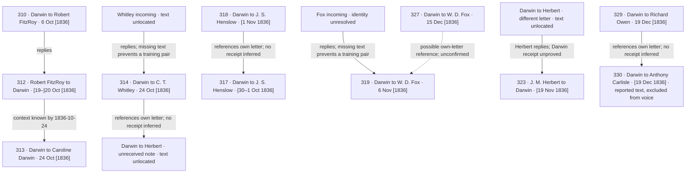

# Post-return Darwin correspondence review: 13 letters

Completed 16 September 2026. Covers individually attributed Darwin outgoing letters after 2 October through 31 December 1836.

**All 13 target letters were read in full. No new complete surviving incoming-prompt / Darwin-response pair was established.** All 13 retain dated-grounding roles. At completion of this batch, the whole map had three established prompt pairs; later batches are reflected in the [current map](../correspondence-map/README.md). Incoming authors never become Darwin voice targets.

Follow-up: three Luna reviewers read all 33 distinct earlier incoming candidates in full, covering 85 comparisons. Their checked assessments are recorded alongside the date screen; [full-reading report](incoming-full-read/README.md). The screen is a broad inventory, not a list of equally plausible prompts.

## What this pass establishes

- **Missing incoming prompts:** Whitley’s input to 314 remains unlocated; Fox’s explicitly answered input to 319 is now recorded as an unresolved reference. Their conservative known-by dates are 24 October and 6 November 1836. No original writing dates, exact delivery dates, or prompt text have been invented.
- **Information across correspondents:** retain FitzRoy 312 → Darwin 313 as context for the engagement news, not Caroline’s conversational prompt.
- **Darwin’s own letters:** 318 references the long letter 317 accompanying the Galapagos plants. 329 references the Carlisle letter represented by 330; 330 remains a minute-book report excluded from Darwin voice. The reference in 329 proves neither dispatch nor Carlisle’s personal receipt; the later minute-book report is separate corroboration.
- **Two Herbert references:** 314 describes an unreceived Shrewsbury note. Herbert’s 323 explains the failed handoff but answers a different Darwin letter received that morning. Both outgoing texts remain unlocated. 323 itself still has no established Darwin knowledge date.
- **One uncertain identity:** 327 probably refers to 319 as the previous letter to Fox at Ryde, but another unlocated outgoing letter remains possible. This stays outside accepted links.

Advice, invitations, loaned objects, future requests, and negated writing events are retained as observations. They do not automatically create incoming-letter nodes. A letter from E. Holland in 313 has an unconfirmed addressee and is therefore outside the to/from-Darwin graph pending identification.

## Letter-by-letter outcomes

Dates below retain the original catalogue wording. XML constraints and original metadata are preserved in every machine-readable dossier. The unusual wording for 317 is retained exactly; its XML interval is 30–31 October and its scalar writing date remains null.

| Letter | Original date | Recipient | Reviewed result |
| --- | --- | --- | --- |
| [307](https://www.darwinproject.ac.uk/letter/?docId=letters/DCP-LETT-307.xml) | [5 Oct 1836] | Josiah, II Wedgwood | Homecoming announcement and retrospective gratitude to Josiah Wedgwood II; no particular incoming letter is acknowledged. |
| [310](https://www.darwinproject.ac.uk/letter/?docId=letters/DCP-LETT-310.xml) | 6 Oct [1836] | Robert FitzRoy | Homecoming news addressed to FitzRoy and a request for a future note. FitzRoy’s later 312 is a reply to this letter, not a possible earlier input. |
| [311](https://www.darwinproject.ac.uk/letter/?docId=letters/DCP-LETT-311.xml) | 6 Oct [1836] | J. S. Henslow | Announces the return and asks Henslow for advice and a return-post answer. No surviving incoming letter is identified as its trigger. |
| [313](https://www.darwinproject.ac.uk/letter/?docId=letters/DCP-LETT-313.xml) | 24 Oct [1836] | Caroline Darwin | 312 is confirmed context for the engagement news. Caroline’s Maer plan has an unspecified communication channel. A letter from E. Holland is mentioned, but its text and addressee are unestablished. |
| [314](https://www.darwinproject.ac.uk/letter/?docId=letters/DCP-LETT-314.xml) | 24 Oct [1836] | C. T. Whitley | Whitley’s acknowledged marriage-news letter remains unlocated. Also attests an unlocated Darwin note to Herbert left at Shrewsbury but reportedly never received. |
| [317](https://www.darwinproject.ac.uk/letter/?docId=letters/DCP-LETT-317.xml) | [30–1 Oct 1836] | J. S. Henslow | Henslow’s advice and lodging offer are acknowledged without naming a letter. Recent visits provide a plausible oral channel. The plant-box dispatch plans change in the body; 318 identifies the accompanying long letter. |
| [318](https://www.darwinproject.ac.uk/letter/?docId=letters/DCP-LETT-318.xml) | [1 Nov 1836] | J. S. Henslow | References the longer letter 317 accompanying the Galapagos plants and asks for future confirmation of arrival. Scientific news is explicitly associated with dinner and a meeting. |
| [319](https://www.darwinproject.ac.uk/letter/?docId=letters/DCP-LETT-319.xml) | 6 Nov [1836] | W. D. Fox | Explicitly answers Fox, but none of the four surviving in-period William Darwin Fox letters is specifically established as that input. Retain the antecedent as unlocated. |
| [320](https://www.darwinproject.ac.uk/letter/?docId=letters/DCP-LETT-320.xml) | [7 Nov 1836] | Charles Wilkes | Proposes a meeting with Wilkes and asks for an alternative time only if needed. No earlier letter is acknowledged and no incoming Wilkes record exists in the pinned catalogue. |
| [321](https://www.darwinproject.ac.uk/letter/?docId=letters/DCP-LETT-321.xml) | [9 Nov 1836] | Caroline Darwin | Reports unsettled travel plans, current fossil work, a map lent by Murchison, and family conversation. No surviving Caroline input is established. |
| [325](https://www.darwinproject.ac.uk/letter/?docId=letters/DCP-LETT-325.xml) | [7 Dec 1836] | Caroline Darwin | Reports visits, journal criticism, invitations, and Lyell’s advice. These do not identify an incoming Caroline letter or authorize backdating later December correspondence. |
| [327](https://www.darwinproject.ac.uk/letter/?docId=letters/DCP-LETT-327.xml) | 15 Dec [1836] | W. D. Fox | Refers to a prior outgoing letter at Ryde, plausibly 319, and continues the travel narrative. The identity is retained as a candidate; no intervening Fox input is established. |
| [329](https://www.darwinproject.ac.uk/letter/?docId=letters/DCP-LETT-329.xml) | 19 Dec [1836] | Richard Owen | Acknowledges Owen’s recommendations without identifying their medium. The just-written Carlisle letter is represented by the reported substance in 330; its original authorial text is unavailable. |

## Reviewed flow

Solid links are accepted relationships. Dashed links are unresolved identities. Reply arrows run from the earlier letter to its answer; an own-letter reference points from the mentioning letter to the document mentioned. The drawing is generated from the map and does not imply a complete postal chronology.



## Evidence and competing candidates

Each item below preserves exact body evidence with paragraph numbers; JSON dossiers also preserve offsets, locators, source URLs, retrieval metadata, and hashes. Same-correspondent candidates come from the XML identity/date screen. Automatically retrieved passages in the dossiers are search aids, not accepted matches.

The initial pass read all 13 outgoing bodies but used targeted passages for some incoming candidates. Follow-up: three gpt-5.6-luna reviewers read all 33 distinct earlier incoming bodies and reread the 10 outgoing bodies with candidate inputs; 85 comparisons were checked. Parent reviewed all rationales and proposed matches, not every incoming body independently. Public-search absence is not proof of destruction.

Full-catalogue checks and rejected identifications for Whitley, Fox, and Herbert are retained in the map’s `search_cases`. A catalogue search that finds no matching text is not proof the text has been destroyed.

### 307

Homecoming announcement and retrospective gratitude to Josiah Wedgwood II; no particular incoming letter is acknowledged.

Earlier records passing the identity/date screen: none in the audited set.

The opening presents news Darwin wishes to send first, rather than identifying an incoming prompt.

- [307](https://www.darwinproject.ac.uk/letter/?docId=letters/DCP-LETT-307.xml), body paragraph 1: “I cannot allow my sisters to tell you first”

Thanks for past assistance do not identify an incoming letter; third-party letters remain excluded.

- [307](https://www.darwinproject.ac.uk/letter/?docId=letters/DCP-LETT-307.xml), body paragraph 1: “I hope in person to thank you, as being my first Lord of the Admiralty”

### 310

Homecoming news addressed to FitzRoy and a request for a future note. FitzRoy’s later 312 is a reply to this letter, not a possible earlier input.

Earlier records passing the identity/date screen: [135](https://www.darwinproject.ac.uk/letter/?docId=letters/DCP-LETT-135.xml), [212](https://www.darwinproject.ac.uk/letter/?docId=letters/DCP-LETT-212.xml), [218](https://www.darwinproject.ac.uk/letter/?docId=letters/DCP-LETT-218.xml).

Full-body comparison outcomes: 135: implausible antecedent; 212: implausible antecedent; 218: implausible antecedent. See the linked full-reading report for reasons and evidence.

Same-correspondent records too late under the XML bounds: [312](https://www.darwinproject.ac.uk/letter/?docId=letters/DCP-LETT-312.xml), [337](https://www.darwinproject.ac.uk/letter/?docId=letters/DCP-LETT-337.xml).

Do not turn a requested future note into an already received letter.

- [310](https://www.darwinproject.ac.uk/letter/?docId=letters/DCP-LETT-310.xml), body paragraph 3: “I hope you will not forget to send me a note telling me how you go on.”

### 311

Announces the return and asks Henslow for advice and a return-post answer. No surviving incoming letter is identified as its trigger.

Earlier records passing the identity/date screen: [105](https://www.darwinproject.ac.uk/letter/?docId=letters/DCP-LETT-105.xml), [143](https://www.darwinproject.ac.uk/letter/?docId=letters/DCP-LETT-143.xml), [150](https://www.darwinproject.ac.uk/letter/?docId=letters/DCP-LETT-150.xml), [157](https://www.darwinproject.ac.uk/letter/?docId=letters/DCP-LETT-157.xml), [196](https://www.darwinproject.ac.uk/letter/?docId=letters/DCP-LETT-196.xml), [213](https://www.darwinproject.ac.uk/letter/?docId=letters/DCP-LETT-213.xml), [249](https://www.darwinproject.ac.uk/letter/?docId=letters/DCP-LETT-249.xml).

Full-body comparison outcomes: 105: background only; 143: background only; 150: background only; 157: background only; 196: background only; 213: background only; 249: background only. See the linked full-reading report for reasons and evidence.

Both the requested Henslow answer and anticipated FitzRoy news are future possibilities, not established inputs.

- [311](https://www.darwinproject.ac.uk/letter/?docId=letters/DCP-LETT-311.xml), body paragraph 1: “Will you be kind enough to write to me one line by return of post saying whether you are now at Cambridge.”
- [311](https://www.darwinproject.ac.uk/letter/?docId=letters/DCP-LETT-311.xml), body paragraph 1: “I am doubtful, till I hear from Capt. F. R. whether I shall not be obliged to start before the answer can arrive”

### 313

312 is confirmed context for the engagement news. Caroline’s Maer plan has an unspecified communication channel. A letter from E. Holland is mentioned, but its text and addressee are unestablished.

Earlier records passing the identity/date screen: [153](https://www.darwinproject.ac.uk/letter/?docId=letters/DCP-LETT-153.xml), [163](https://www.darwinproject.ac.uk/letter/?docId=letters/DCP-LETT-163.xml), [173](https://www.darwinproject.ac.uk/letter/?docId=letters/DCP-LETT-173.xml), [185](https://www.darwinproject.ac.uk/letter/?docId=letters/DCP-LETT-185.xml), [195](https://www.darwinproject.ac.uk/letter/?docId=letters/DCP-LETT-195.xml), [202](https://www.darwinproject.ac.uk/letter/?docId=letters/DCP-LETT-202.xml), [205](https://www.darwinproject.ac.uk/letter/?docId=letters/DCP-LETT-205.xml), [214](https://www.darwinproject.ac.uk/letter/?docId=letters/DCP-LETT-214.xml), [224](https://www.darwinproject.ac.uk/letter/?docId=letters/DCP-LETT-224.xml), [234](https://www.darwinproject.ac.uk/letter/?docId=letters/DCP-LETT-234.xml), [239](https://www.darwinproject.ac.uk/letter/?docId=letters/DCP-LETT-239.xml), [257](https://www.darwinproject.ac.uk/letter/?docId=letters/DCP-LETT-257.xml), [265](https://www.darwinproject.ac.uk/letter/?docId=letters/DCP-LETT-265.xml), [266](https://www.darwinproject.ac.uk/letter/?docId=letters/DCP-LETT-266.xml), [273](https://www.darwinproject.ac.uk/letter/?docId=letters/DCP-LETT-273.xml), [291](https://www.darwinproject.ac.uk/letter/?docId=letters/DCP-LETT-291.xml), [300](https://www.darwinproject.ac.uk/letter/?docId=letters/DCP-LETT-300.xml).

Full-body comparison outcomes: 153: no specific link; 163: no specific link; 173: no specific link; 185: no specific link; 195: no specific link; 202: no specific link; 205: no specific link; 214: no specific link; 224: no specific link; 234: no specific link; 239: no specific link; 257: no specific link; 265: no specific link; 266: no specific link; 273: no specific link; 291: no specific link; 300: no specific link. See the linked full-reading report for reasons and evidence.

Retain 312→313; the real addressee is Caroline.

- [313](https://www.darwinproject.ac.uk/letter/?docId=letters/DCP-LETT-313.xml), body paragraph 1: “I have heard from the Captain”
- [313](https://www.darwinproject.ac.uk/letter/?docId=letters/DCP-LETT-313.xml), body paragraph 1: “will keep the letter”

Caroline’s plan is acknowledged, but it could have been conveyed in writing or in person. No matching surviving Caroline letter establishes a prompt.

- [313](https://www.darwinproject.ac.uk/letter/?docId=letters/DCP-LETT-313.xml), body paragraph 2: “I think your plan of my going direct to Maer a very good one”

Darwin discusses an E. Holland letter. Preserve the initials without conflating E. with Dr Henry Holland. No matching pre-1837 catalogue letter was found; the addressee is not stated, so it is not admitted as a new to-Darwin node.

- [313](https://www.darwinproject.ac.uk/letter/?docId=letters/DCP-LETT-313.xml), body paragraph 3: “The letter from E. Holland contained no message.”

### 314

Whitley’s acknowledged marriage-news letter remains unlocated. Also attests an unlocated Darwin note to Herbert left at Shrewsbury but reportedly never received.

Earlier records passing the identity/date screen: [125](https://www.darwinproject.ac.uk/letter/?docId=letters/DCP-LETT-125.xml), [267](https://www.darwinproject.ac.uk/letter/?docId=letters/DCP-LETT-267.xml).

Full-body comparison outcomes: 125: no specific link; 267: no specific link. See the linked full-reading report for reasons and evidence.

Keep the prior Whitley reference and relative receipt expression; no replacement prompt can be generated from the reply.

- [314](https://www.darwinproject.ac.uk/letter/?docId=letters/DCP-LETT-314.xml), body paragraph 1: “I was very glad to receive your letter, which I did the day previous to my leaving Shrewsbury.”
- [314](https://www.darwinproject.ac.uk/letter/?docId=letters/DCP-LETT-314.xml), body paragraph 3: “In your last letter you told me, nothing beyond the main grand event”

Record a separate Darwin-to-Herbert note. Later 323 confirms the failed handoff but is not knowledge available to Darwin in 314.

- [314](https://www.darwinproject.ac.uk/letter/?docId=letters/DCP-LETT-314.xml), body paragraph 2: “I left a letter for him, but which he has never received.”

Later incoming 323 distinguishes the current letter it answers from the earlier note not handed over. This evidence helps reconstruct two outgoing documents, but 323 has no established Darwin receipt date and cannot enter the context for 314.

- [323](https://www.darwinproject.ac.uk/letter/?docId=letters/DCP-LETT-323.xml), body paragraph 1: “as your letter lay on my breakfast table this morning”
- [323](https://www.darwinproject.ac.uk/letter/?docId=letters/DCP-LETT-323.xml), body paragraph 1: “which will excuse the servant from the charge of stupidity in not giving me the letter”
- [323](https://www.darwinproject.ac.uk/letter/?docId=letters/DCP-LETT-323.xml), body paragraph 3: “You ask me about my future plans;”

### 317

Henslow’s advice and lodging offer are acknowledged without naming a letter. Recent visits provide a plausible oral channel. The plant-box dispatch plans change in the body; 318 identifies the accompanying long letter.

Earlier records passing the identity/date screen: [105](https://www.darwinproject.ac.uk/letter/?docId=letters/DCP-LETT-105.xml), [143](https://www.darwinproject.ac.uk/letter/?docId=letters/DCP-LETT-143.xml), [150](https://www.darwinproject.ac.uk/letter/?docId=letters/DCP-LETT-150.xml), [157](https://www.darwinproject.ac.uk/letter/?docId=letters/DCP-LETT-157.xml), [196](https://www.darwinproject.ac.uk/letter/?docId=letters/DCP-LETT-196.xml), [213](https://www.darwinproject.ac.uk/letter/?docId=letters/DCP-LETT-213.xml), [249](https://www.darwinproject.ac.uk/letter/?docId=letters/DCP-LETT-249.xml).

Full-body comparison outcomes: 105: background only; 143: no specific link; 150: background only; 157: background only; 196: background only; 213: background only; 249: background only. See the linked full-reading report for reasons and evidence.

Neither the advice nor lodging offer explicitly identifies a written input. Earlier incoming Henslow letters share specimen topics but do not establish this particular exchange.

- [317](https://www.darwinproject.ac.uk/letter/?docId=letters/DCP-LETT-317.xml), body paragraph 1: “I find, as you told me, that they are all overwhelmed, with their own business.”
- [317](https://www.darwinproject.ac.uk/letter/?docId=letters/DCP-LETT-317.xml), body paragraph 2: “your really most kind offer of talking with Mrs. Henslow about my taking up my quarters with you”

Retain the dated Monday continuation and undated final change. Original XML bounds 30–31 October and the edition’s date wording remain unchanged; do not invent a final postscript or arrival day.

- [317](https://www.darwinproject.ac.uk/letter/?docId=letters/DCP-LETT-317.xml), body paragraph 5: “Monday evening I have determined to send the plants by wagon”
- [317](https://www.darwinproject.ac.uk/letter/?docId=letters/DCP-LETT-317.xml), body paragraph 7: “Again I have been compelled to change my plans.”
- [317](https://www.darwinproject.ac.uk/letter/?docId=letters/DCP-LETT-317.xml), body paragraph 7: “I send the plants, per coach, & this letter with them.”

### 318

References the longer letter 317 accompanying the Galapagos plants and asks for future confirmation of arrival. Scientific news is explicitly associated with dinner and a meeting.

Earlier records passing the identity/date screen: [105](https://www.darwinproject.ac.uk/letter/?docId=letters/DCP-LETT-105.xml), [143](https://www.darwinproject.ac.uk/letter/?docId=letters/DCP-LETT-143.xml), [150](https://www.darwinproject.ac.uk/letter/?docId=letters/DCP-LETT-150.xml), [157](https://www.darwinproject.ac.uk/letter/?docId=letters/DCP-LETT-157.xml), [196](https://www.darwinproject.ac.uk/letter/?docId=letters/DCP-LETT-196.xml), [213](https://www.darwinproject.ac.uk/letter/?docId=letters/DCP-LETT-213.xml), [249](https://www.darwinproject.ac.uk/letter/?docId=letters/DCP-LETT-249.xml).

Full-body comparison outcomes: 105: background only; 143: no specific link; 150: no specific link; 157: background only; 196: background only; 213: background only; 249: background only. See the linked full-reading report for reasons and evidence.

317 is the identified companion letter; both are Darwin writing, so this does not produce an incoming prompt.

- [318](https://www.darwinproject.ac.uk/letter/?docId=letters/DCP-LETT-318.xml), body paragraph 1: “the box with the Galapagos plants, which also contains a longer letter.”

The expected arrival order is a prediction, not evidence that Henslow received either item.

- [318](https://www.darwinproject.ac.uk/letter/?docId=letters/DCP-LETT-318.xml), body paragraph 1: “You will have probably received, before this letter reaches you”
- [318](https://www.darwinproject.ac.uk/letter/?docId=letters/DCP-LETT-318.xml), body paragraph 3: “Pray write me a line to say how the Cambridge world is going on; & whether my boxes arrive safely.”

The dinner/meeting supplies an explicit non-letter setting for new information; it does not prove a written input from Bell or Broderip.

- [318](https://www.darwinproject.ac.uk/letter/?docId=letters/DCP-LETT-318.xml), body paragraph 3: “I have just returned from dining at the Linnæan club”

### 319

Explicitly answers Fox, but none of the four surviving in-period William Darwin Fox letters is specifically established as that input. Retain the antecedent as unlocated.

Earlier records passing the identity/date screen: [175](https://www.darwinproject.ac.uk/letter/?docId=letters/DCP-LETT-175.xml), [184](https://www.darwinproject.ac.uk/letter/?docId=letters/DCP-LETT-184.xml), [197](https://www.darwinproject.ac.uk/letter/?docId=letters/DCP-LETT-197.xml), [261](https://www.darwinproject.ac.uk/letter/?docId=letters/DCP-LETT-261.xml).

Full-body comparison outcomes: 175: no specific link; 184: no specific link; 197: no specific link; 261: background only. See the linked full-reading report for reasons and evidence.

The acknowledgment establishes an incoming letter, but its composition date and surviving identity are unresolved.

- [319](https://www.darwinproject.ac.uk/letter/?docId=letters/DCP-LETT-319.xml), body paragraph 1: “I have taken a shamefully long time in answering your letter.”

The visit offer is a useful discriminator. Do not assume every other fact or family detail necessarily came in that same letter.

- [319](https://www.darwinproject.ac.uk/letter/?docId=letters/DCP-LETT-319.xml), body paragraph 3: “though you have offered to come up all the way to London, merely for a flying visit.”
- [319](https://www.darwinproject.ac.uk/letter/?docId=letters/DCP-LETT-319.xml), body paragraph 5: “I am delighted to hear you are turned Geologist.”
- [319](https://www.darwinproject.ac.uk/letter/?docId=letters/DCP-LETT-319.xml), body paragraph 9: “Pray tell me what relation I am your daughter”

### 320

Proposes a meeting with Wilkes and asks for an alternative time only if needed. No earlier letter is acknowledged and no incoming Wilkes record exists in the pinned catalogue.

Earlier records passing the identity/date screen: none in the audited set.

A conditional request for a future reply is not an incoming prompt.

- [320](https://www.darwinproject.ac.uk/letter/?docId=letters/DCP-LETT-320.xml), body paragraph 1: “I have thought the best plan of meeting would be to fix some hour.”
- [320](https://www.darwinproject.ac.uk/letter/?docId=letters/DCP-LETT-320.xml), body paragraph 1: “If this hour is inconvenient, will you send me one line”

### 321

Reports unsettled travel plans, current fossil work, a map lent by Murchison, and family conversation. No surviving Caroline input is established.

Earlier records passing the identity/date screen: [153](https://www.darwinproject.ac.uk/letter/?docId=letters/DCP-LETT-153.xml), [163](https://www.darwinproject.ac.uk/letter/?docId=letters/DCP-LETT-163.xml), [173](https://www.darwinproject.ac.uk/letter/?docId=letters/DCP-LETT-173.xml), [185](https://www.darwinproject.ac.uk/letter/?docId=letters/DCP-LETT-185.xml), [195](https://www.darwinproject.ac.uk/letter/?docId=letters/DCP-LETT-195.xml), [202](https://www.darwinproject.ac.uk/letter/?docId=letters/DCP-LETT-202.xml), [205](https://www.darwinproject.ac.uk/letter/?docId=letters/DCP-LETT-205.xml), [214](https://www.darwinproject.ac.uk/letter/?docId=letters/DCP-LETT-214.xml), [224](https://www.darwinproject.ac.uk/letter/?docId=letters/DCP-LETT-224.xml), [234](https://www.darwinproject.ac.uk/letter/?docId=letters/DCP-LETT-234.xml), [239](https://www.darwinproject.ac.uk/letter/?docId=letters/DCP-LETT-239.xml), [257](https://www.darwinproject.ac.uk/letter/?docId=letters/DCP-LETT-257.xml), [265](https://www.darwinproject.ac.uk/letter/?docId=letters/DCP-LETT-265.xml), [266](https://www.darwinproject.ac.uk/letter/?docId=letters/DCP-LETT-266.xml), [273](https://www.darwinproject.ac.uk/letter/?docId=letters/DCP-LETT-273.xml), [291](https://www.darwinproject.ac.uk/letter/?docId=letters/DCP-LETT-291.xml), [300](https://www.darwinproject.ac.uk/letter/?docId=letters/DCP-LETT-300.xml).

Full-body comparison outcomes: 153: no specific link; 163: no specific link; 173: no specific link; 185: no specific link; 195: no specific link; 202: no specific link; 205: no specific link; 214: no specific link; 224: no specific link; 234: no specific link; 239: background only; 257: background only; 265: background only; 266: no specific link; 273: no specific link; 291: no specific link; 300: no specific link. See the linked full-reading report for reasons and evidence.

Do not create a missing letter for the explicitly unwritten previous evening.

- [321](https://www.darwinproject.ac.uk/letter/?docId=letters/DCP-LETT-321.xml), body paragraph 1: “I did not write yesterday Evening because my plans were so unsettled.”

A map loan and request are established, but their delivery/communication channel is not specified as a letter.

- [321](https://www.darwinproject.ac.uk/letter/?docId=letters/DCP-LETT-321.xml), body paragraph 1: “Mr. Murchison has lent me a manuscript map, and has asked me to look at a part of the Country”

Do not infer a Caroline letter from the fact that Darwin reports family news. Later editorial fossil names stay outside the persona context.

- [321](https://www.darwinproject.ac.uk/letter/?docId=letters/DCP-LETT-321.xml), body paragraph 2: “Erasmus is just returned from driving out Miss Martineau.”

### 325

Reports visits, journal criticism, invitations, and Lyell’s advice. These do not identify an incoming Caroline letter or authorize backdating later December correspondence.

Earlier records passing the identity/date screen: [153](https://www.darwinproject.ac.uk/letter/?docId=letters/DCP-LETT-153.xml), [163](https://www.darwinproject.ac.uk/letter/?docId=letters/DCP-LETT-163.xml), [173](https://www.darwinproject.ac.uk/letter/?docId=letters/DCP-LETT-173.xml), [185](https://www.darwinproject.ac.uk/letter/?docId=letters/DCP-LETT-185.xml), [195](https://www.darwinproject.ac.uk/letter/?docId=letters/DCP-LETT-195.xml), [202](https://www.darwinproject.ac.uk/letter/?docId=letters/DCP-LETT-202.xml), [205](https://www.darwinproject.ac.uk/letter/?docId=letters/DCP-LETT-205.xml), [214](https://www.darwinproject.ac.uk/letter/?docId=letters/DCP-LETT-214.xml), [224](https://www.darwinproject.ac.uk/letter/?docId=letters/DCP-LETT-224.xml), [234](https://www.darwinproject.ac.uk/letter/?docId=letters/DCP-LETT-234.xml), [239](https://www.darwinproject.ac.uk/letter/?docId=letters/DCP-LETT-239.xml), [257](https://www.darwinproject.ac.uk/letter/?docId=letters/DCP-LETT-257.xml), [265](https://www.darwinproject.ac.uk/letter/?docId=letters/DCP-LETT-265.xml), [266](https://www.darwinproject.ac.uk/letter/?docId=letters/DCP-LETT-266.xml), [273](https://www.darwinproject.ac.uk/letter/?docId=letters/DCP-LETT-273.xml), [291](https://www.darwinproject.ac.uk/letter/?docId=letters/DCP-LETT-291.xml), [300](https://www.darwinproject.ac.uk/letter/?docId=letters/DCP-LETT-300.xml).

Full-body comparison outcomes: 153: background only; 163: no specific link; 173: no specific link; 185: no specific link; 195: no specific link; 202: no specific link; 205: no specific link; 214: no specific link; 224: background only; 234: no specific link; 239: no specific link; 257: no specific link; 265: no specific link; 266: no specific link; 273: no specific link; 291: background only; 300: no specific link. See the linked full-reading report for reasons and evidence.

The text situates advice and prospective journal criticism among visits. No letter input is identified.

- [325](https://www.darwinproject.ac.uk/letter/?docId=letters/DCP-LETT-325.xml), body paragraph 1: “On Sunday I dined at Clapham”
- [325](https://www.darwinproject.ac.uk/letter/?docId=letters/DCP-LETT-325.xml), body paragraph 1: “Fanny & Hensleigh have agreed to look over my Journal”
- [325](https://www.darwinproject.ac.uk/letter/?docId=letters/DCP-LETT-325.xml), body paragraph 1: “Dr Holland looked over a few pages”
- [325](https://www.darwinproject.ac.uk/letter/?docId=letters/DCP-LETT-325.xml), body paragraph 1: “I have seen Lyell, who was exceedingly friendly, & gave me much sensible advice”

Hensleigh’s 332 (20 December) and Lyell’s 335 (26 December) cannot be inputs to this 7 December writing. They are checked only as later comparison documents.

- [325](https://www.darwinproject.ac.uk/letter/?docId=letters/DCP-LETT-325.xml), body paragraph 1: “Fanny & Hensleigh have agreed to look over my Journal”
- [325](https://www.darwinproject.ac.uk/letter/?docId=letters/DCP-LETT-325.xml), body paragraph 1: “I have seen Lyell, who was exceedingly friendly, & gave me much sensible advice”

### 327

Refers to a prior outgoing letter at Ryde, plausibly 319, and continues the travel narrative. The identity is retained as a candidate; no intervening Fox input is established.

Earlier records passing the identity/date screen: [175](https://www.darwinproject.ac.uk/letter/?docId=letters/DCP-LETT-175.xml), [184](https://www.darwinproject.ac.uk/letter/?docId=letters/DCP-LETT-184.xml), [197](https://www.darwinproject.ac.uk/letter/?docId=letters/DCP-LETT-197.xml), [261](https://www.darwinproject.ac.uk/letter/?docId=letters/DCP-LETT-261.xml).

Full-body comparison outcomes: 175: no specific link; 184: no specific link; 197: no specific link; 261: no specific link. See the linked full-reading report for reasons and evidence.

319 is a plausible match to the earlier outgoing letter, but another unlocated letter cannot be ruled out. Keep the candidate outside accepted edges.

- [327](https://www.darwinproject.ac.uk/letter/?docId=letters/DCP-LETT-327.xml), body paragraph 1: “It is now sometime since I wrote to you at Ryde”

A father’s greeting relayed by Darwin is not a separate third-party letter.

- [327](https://www.darwinproject.ac.uk/letter/?docId=letters/DCP-LETT-327.xml), body paragraph 3: “My father told me, next time I wrote, to remember him most kindly to Mrs Fox and yourself”

The renewed request for news does not establish receipt of an intervening Fox letter.

- [327](https://www.darwinproject.ac.uk/letter/?docId=letters/DCP-LETT-327.xml), body paragraph 5: “But pray write to me”

### 329

Acknowledges Owen’s recommendations without identifying their medium. The just-written Carlisle letter is represented by the reported substance in 330; its original authorial text is unavailable.

Earlier records passing the identity/date screen: none in the audited set.

Advice may have been oral or written; no pre-1837 incoming Richard Owen letter is catalogued. Do not substitute William Owen or infer a lost letter solely from this wording.

- [329](https://www.darwinproject.ac.uk/letter/?docId=letters/DCP-LETT-329.xml), body paragraph 1: “I have done exactly as you recommended me.”
- [329](https://www.darwinproject.ac.uk/letter/?docId=letters/DCP-LETT-329.xml), body paragraph 2: “I cannot do better than follow your advice.”

Link the document reference to 330 while preserving its minute-book status and voice exclusion. Intended simultaneous sending does not prove actual dispatch or receipt.

- [329](https://www.darwinproject.ac.uk/letter/?docId=letters/DCP-LETT-329.xml), body paragraph 1: “I have just written and will send at the same time with this, a letter to Sir Ant: Carlisle.”

## Reproducibility and limits

- [dossiers.jsonl](dossiers.jsonl): 13 complete review records, original metadata, XML constraints, reviewed evidence, and a reproducible same-correspondent search screen.
- [summary.json](summary.json): coverage, outcomes, unchanged-source checks, and input hashes.
- [Correspondence graph](../correspondence-map/graph.json): accepted and candidate links, the four unlocated reference nodes from this batch, detailed search cases, and later integrated reviews.
- [Editable annotations](../../data/annotations/correspondence_links.json): the reviewed source for these derived outputs.

The original XML audit, raw pages, and extracted letter bodies are unchanged. The 13 targets include uncertainly dated 317 but exclude reported text 330. Candidate pools can include voyage-era incoming letters; no recent-mail assumption excludes them. This pass is a completed review of these 13 outgoing texts, not an exhaustive search of every archive or a complete receipt chronology. No training export or model training has run.

Rebuild offline with Python 3.11+:

```sh
python3 scripts/build_correspondence_map.py
python3 scripts/build_post_return_review.py
python3 -m unittest discover -s tests -v
```
