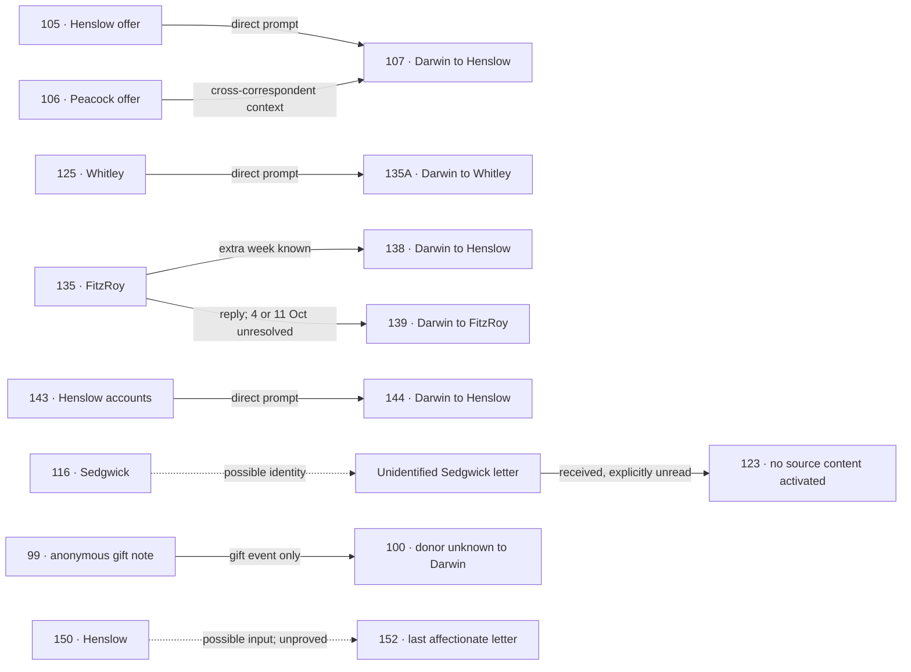

# Pre-Beagle correspondence: 1828–1831

Completed 16 September 2026. All 80 eligible Darwin outgoing bodies were read in full for the initial survey, then independently reviewed by three Luna reviewers. The reviewers also read all 34 incoming bodies. Letter 153, spanning 20–31 December 1831, remains outside the pre-departure comparison set and postdates every outgoing target here.

The batch has **3 complete surviving prompt–response pairs** under the current timing policy, including the previously established 125 → 135A. **77 outgoing letters retain grounding roles**; some have explicit missing prompts or a supported reply whose date is unresolved. Incoming prose never becomes Darwin's voice.

## Findings

- **Three usable surviving prompt pairs in this batch:** 105 → 107 (Henslow's offer and Darwin's refusal), 125 → 135A (Whitley's farewell, previously established), and 143 → 144 (Henslow's bill correction and consignment directions). These remain curation candidates for a future exporter; no training was run.
- **A fourth direct reply has unresolved timing:** 135 → 139 is identified by the quoted shoregoing-fellows phrase. Letter 139 retains its original 4-or-11 October alternatives and no scalar writing date, so it is held out of automatic prompt pairing.
- **Knowledge can cross correspondents:** 135's extra week is relayed in 138 to Henslow. The separately attributed Henslow 105 and Peacock 106 offer letters are known by 107 and reused in later accounts to Fox and Whitley. Only Henslow 105 is the direct prompt for 107.
- **Receipt is not reading:** 123 explicitly says a Sedgwick letter was received that day but not read. The letter's identity as 116 is plausible, not proved. Neither the unresolved reference nor 116 supplies content to 123.
- **The anonymous microscope remains anonymous:** 99 and 100 describe the same gift event. The archive identifies Herbert, but Darwin in 100 wants to know who the donor was. Full-note reading is unproved; the gift fact and archival author are kept separate.
- **Two tempting matches fail:** 135 does not contain the other-vessel/talc advice answered in 142. And 150 contains no Ramsay memorial reference; 150 → 152 stays a candidate, with an explicit incoming reference whose identity is unresolved. No fictitious prompt text is supplied.
- **Fox dominates the earlier voice:** 46 of 80 outgoing letters are to Fox, with no surviving pre-departure Fox incoming text in this batch. Explicit acknowledgments, two-letter and three-letter bundles, crossed letters, failed forwarding and rereading are recorded as references; they are not a count of distinct missing physical letters.
- **Incoming replies work in the other direction too:** 125 answers 121, 143 answers 140, 150 answers 147, and 135 answers 131 plus a separate missing young-Owen request. These relations do not make the incoming texts Darwin's voice or prove when he received them.
- **Luna proposals were adjudicated:** corrected reversed edges, cross-correspondent reply labels, self-loops and inappropriate unread/third-party classifications. Original proposals remain available alongside parent decisions rather than silently replacing their evidence.

## Selected correspondence flow



Solid arrows above are accepted information or reply relationships. Dashed arrows are unresolved identities or unavailable texts. Arrow direction in this diagram follows information flow; machine-readable replies point from response to input. The diagram is a selected view, not a complete timeline.

## Every outgoing letter

Original catalogue dates are retained, including alternatives and question marks. Each dossier includes the unchanged metadata and XML constraints, initial hypothesis, independent review, parent decision, exact evidence and source hashes.

| Letter | Original date | Recipient | Final assessment | Prompt IDs |
| --- | --- | --- | --- | --- |
| [42](https://www.darwinproject.ac.uk/letter/?docId=letters/DCP-LETT-42.xml) | 12 [June 1828] | W. D. Fox | Initiates insect-identification questions and asks Fox for news; no incoming letter explicitly acknowledged. | — |
| [43](https://www.darwinproject.ac.uk/letter/?docId=letters/DCP-LETT-43.xml) | [30 June 1828] | W. D. Fox | Acknowledges a Fox letter and parcel; has read a forwarded Way letter and reports hearing from Erasmus. | — |
| [45](https://www.darwinproject.ac.uk/letter/?docId=letters/DCP-LETT-45.xml) | [29 July 1828] | W. D. Fox | Still awaits Fox’s answer; repeats questions and prospective visit. | — |
| [45A](https://www.darwinproject.ac.uk/letter/?docId=letters/DCP-LETT-45A.xml) | [10 Aug 1828] | C. T. Whitley | Answers an unlocated Whitley admonition about mathematics and idleness. | — |
| [46](https://www.darwinproject.ac.uk/letter/?docId=letters/DCP-LETT-46.xml) | [19 Aug 1828] | W. D. Fox | Replies to a Fox letter that crossed Darwin’s reproachful letter; accepts invitation and discusses insect answers. | — |
| [47](https://www.darwinproject.ac.uk/letter/?docId=letters/DCP-LETT-47.xml) | [13 Sept 1828] | J. M. Herbert | Fulfils a promise to write Herbert and requests insect specimens; no incoming input identified. | — |
| [48](https://www.darwinproject.ac.uk/letter/?docId=letters/DCP-LETT-48.xml) | [Oct 1828] | W. D. Fox | Sends Fox birds and insects after a visit; has seen Julia Fox’s letter, apparently shared with Catherine. | — |
| [49](https://www.darwinproject.ac.uk/letter/?docId=letters/DCP-LETT-49.xml) | [3 Oct 1828] | J. M. Herbert | Answers a delayed unlocated Herbert letter; recounts an unlocated exchange with Whitley. | — |
| [50](https://www.darwinproject.ac.uk/letter/?docId=letters/DCP-LETT-50.xml) | 3 Oct 1828 | Darwin family | Humorous petition to family for a replacement gun, with subscription amounts; no incoming prompt. | — |
| [52](https://www.darwinproject.ac.uk/letter/?docId=letters/DCP-LETT-52.xml) | [29 Oct 1828] | W. D. Fox | Explicitly answers Fox’s unlocated letter about losses and gives news of meeting Hope. | — |
| [53](https://www.darwinproject.ac.uk/letter/?docId=letters/DCP-LETT-53.xml) | 21 Dec 1828 | E. A. Darwin | Darwin’s own contribution on Susan’s third sheet to Erasmus; apologizes for silence without identifying an incoming letter. | — |
| [54](https://www.darwinproject.ac.uk/letter/?docId=letters/DCP-LETT-54.xml) | [24 Dec 1828] | W. D. Fox | Reports home arrival, requests Fox’s news, and relays a Bessy Galton letter to Catherine. | — |
| [55](https://www.darwinproject.ac.uk/letter/?docId=letters/DCP-LETT-55.xml) | [7 Jan 1829] | W. D. Fox | Thanks Fox for a detailed entomological account and responds to news; the communication channel is implicit. | — |
| [56](https://www.darwinproject.ac.uk/letter/?docId=letters/DCP-LETT-56.xml) | [25–9 Jan 1829] | W. D. Fox | Waits unsuccessfully for a letter, but acknowledges a newspaper and a swan received separately. | — |
| [57](https://www.darwinproject.ac.uk/letter/?docId=letters/DCP-LETT-57.xml) | [26 Feb 1829] | W. D. Fox | Acknowledges a long Fox letter and discovers his own earlier letter was never forwarded. | — |
| [59](https://www.darwinproject.ac.uk/letter/?docId=letters/DCP-LETT-59.xml) | [15 Mar 1829] | W. D. Fox | Answers a Fox letter, including a money question and curacy news. | — |
| [60](https://www.darwinproject.ac.uk/letter/?docId=letters/DCP-LETT-60.xml) | 1 Apr [1829] | W. D. Fox | Complains Fox has not answered; quotes a Fox-to-Holden letter and refers to his own earlier dispatch. | — |
| [61](https://www.darwinproject.ac.uk/letter/?docId=letters/DCP-LETT-61.xml) | [10 Apr 1829] | W. D. Fox | Acknowledges a Fox letter that arrived on the day Darwin wrote again to Clifton; responds to proposed plans. | — |
| [62](https://www.darwinproject.ac.uk/letter/?docId=letters/DCP-LETT-62.xml) | [12 Apr 1829] | W. D. Fox | Answers Fox’s alarming sister-illness letter received the previous morning; references his own preceding Bath letter. | — |
| [63](https://www.darwinproject.ac.uk/letter/?docId=letters/DCP-LETT-63.xml) | [23 Apr 1829] | W. D. Fox | Condoles Fox after Catherine’s letter reports the death; also references Fox’s earlier ominous letter. | — |
| [64](https://www.darwinproject.ac.uk/letter/?docId=letters/DCP-LETT-64.xml) | [18 May 1829] | W. D. Fox | Answers Fox’s letter about bills, family grief, and an invitation; also acknowledges Pulleine inquiry. | — |
| [66](https://www.darwinproject.ac.uk/letter/?docId=letters/DCP-LETT-66.xml) | 7 June [1829] | W. D. Fox | Acts on Fox’s last letter about packing, commissions, and money; accounts for shipment rather than confirmed arrival. | — |
| [67](https://www.darwinproject.ac.uk/letter/?docId=letters/DCP-LETT-67.xml) | [3 July 1829] | W. D. Fox | Reports unsuccessful Welsh trip and asks for Fox news after silence; acknowledges a Hope parcel, not a letter. | — |
| [68](https://www.darwinproject.ac.uk/letter/?docId=letters/DCP-LETT-68.xml) | [15 July 1829] | W. D. Fox | Thanks Fox for a quick reply and answers concerns over boxes and escaped insects. | — |
| [69](https://www.darwinproject.ac.uk/letter/?docId=letters/DCP-LETT-69.xml) | 29 [July 1829] | W. D. Fox | Sends delayed birds/beasts and discusses visit plans learned through Catherine; requests Fox’s clarification. | — |
| [70](https://www.darwinproject.ac.uk/letter/?docId=letters/DCP-LETT-70.xml) | 26 [Aug 1829] | W. D. Fox | Answers a Fox invitation found on returning home; requests confirmation and acknowledges safe arrival of specimens. | — |
| [71](https://www.darwinproject.ac.uk/letter/?docId=letters/DCP-LETT-71.xml) | 4 Sept [1829] | W. D. Fox | Acknowledges Fox’s confirmation that Darwin can visit next week. | — |
| [72](https://www.darwinproject.ac.uk/letter/?docId=letters/DCP-LETT-72.xml) | [22 Sept 1829] | W. D. Fox | Reports changed Erasmus plans after visiting Fox, and news from an explicit Turner letter. | — |
| [73](https://www.darwinproject.ac.uk/letter/?docId=letters/DCP-LETT-73.xml) | [15 Oct 1829] | W. D. Fox | Reports music and Cambridge; confirms Fox’s conjecture about a letter found in his coat, without identifying its author/addressee. | — |
| [74](https://www.darwinproject.ac.uk/letter/?docId=letters/DCP-LETT-74.xml) | [3 Nov 1829] | W. D. Fox | Relays Aiken’s messages and family illness news; no specific incoming letter acknowledged. | — |
| [75](https://www.darwinproject.ac.uk/letter/?docId=letters/DCP-LETT-75.xml) | [3 Jan 1830] | W. D. Fox | Belatedly answers a Fox letter received nearly six weeks earlier; mentions his own letter to Baker. | — |
| [76](https://www.darwinproject.ac.uk/letter/?docId=letters/DCP-LETT-76.xml) | [13 Jan 1830] | W. D. Fox | Answers a kind Fox letter that crossed Darwin’s apologetic letter; asks about a visit and insect identifications. | — |
| [78](https://www.darwinproject.ac.uk/letter/?docId=letters/DCP-LETT-78.xml) | [25 Mar 1830] | W. D. Fox | Announces passing Little Go and requests a return-post letter about Fox’s visit; no incoming prompt identified. | — |
| [79](https://www.darwinproject.ac.uk/letter/?docId=letters/DCP-LETT-79.xml) | [1 Apr 1830] | W. D. Fox | Answers a Fox letter whose Erasmus news changed Darwin’s travel plans; also reports hearing from Hope. | — |
| [80](https://www.darwinproject.ac.uk/letter/?docId=letters/DCP-LETT-80.xml) | [9 May 1830] | W. D. Fox | Declines an Osmaston invitation and proposes Fox visit Shrewsbury; invitation channel unspecified. | — |
| [81](https://www.darwinproject.ac.uk/letter/?docId=letters/DCP-LETT-81.xml) | [31 May 1830] | W. D. Fox | Welcomes Fox’s approval of a visit plan and has received a letter from Simpson. | — |
| [82](https://www.darwinproject.ac.uk/letter/?docId=letters/DCP-LETT-82.xml) | 25 [Aug 1830] | W. D. Fox | Answers two long Fox letters delayed by travel and discusses shared Maer experience. | — |
| [84](https://www.darwinproject.ac.uk/letter/?docId=letters/DCP-LETT-84.xml) | [8 Sept 1830] | W. D. Fox | Replies to Fox’s bad news about his mother and says he forwarded the letter home. | — |
| [86](https://www.darwinproject.ac.uk/letter/?docId=letters/DCP-LETT-86.xml) | [8 Oct 1830] | W. D. Fox | Answers a Fox letter received before leaving home, reporting improved maternal health. | — |
| [87](https://www.darwinproject.ac.uk/letter/?docId=letters/DCP-LETT-87.xml) | 5 Nov [1830] | W. D. Fox | Answers three Fox letters; the last enclosed money. Also mentions a single home letter and news from Simpson. | — |
| [88](https://www.darwinproject.ac.uk/letter/?docId=letters/DCP-LETT-88.xml) | [27? Nov 1830] | W. D. Fox | Answers business particulars about boxes and accounts, but does not explicitly identify a new letter; date is questioned. | — |
| [89](https://www.darwinproject.ac.uk/letter/?docId=letters/DCP-LETT-89.xml) | [23 Jan 1831] | W. D. Fox | Congratulates Fox on his examination and requests detailed news; reports sending a newspaper. | — |
| [92](https://www.darwinproject.ac.uk/letter/?docId=letters/DCP-LETT-92.xml) | [9 Feb 1831] | W. D. Fox | Directly answers Fox’s letter about accounts and Erasmus; mentions writing Baker and supplies Simpson’s address. | — |
| [94](https://www.darwinproject.ac.uk/letter/?docId=letters/DCP-LETT-94.xml) | [15 Feb 1831] | W. D. Fox | Carries out Fox's business instructions through Baker; may continue the same input as 92. | — |
| [96](https://www.darwinproject.ac.uk/letter/?docId=letters/DCP-LETT-96.xml) | [7 Apr 1831] | W. D. Fox | Still awaits Fox’s answer but rereads an older letter for the Orridge bill; distinguishes possession from new receipt. | — |
| [98](https://www.darwinproject.ac.uk/letter/?docId=letters/DCP-LETT-98.xml) | [28 Apr 1831] | Caroline Darwin | Writes Caroline to request politics and gossip and describes current Cambridge plans. | — |
| [100](https://www.darwinproject.ac.uk/letter/?docId=letters/DCP-LETT-100.xml) | [11 May 1831] | W. D. Fox | Reports an anonymous microscope gift matching 99's event; the donor's identity and reading of the accompanying note remain unestablished. | — |
| [101](https://www.darwinproject.ac.uk/letter/?docId=letters/DCP-LETT-101.xml) | [9 July 1831] | W. D. Fox | Answers Fox's response to Darwin's declined visit; the earlier outgoing letter is possibly 100, with identity held as a candidate. | — |
| [102](https://www.darwinproject.ac.uk/letter/?docId=letters/DCP-LETT-102.xml) | [11 July 1831] | J. S. Henslow | Reports clinometer and Canaries arrangements, asks Henslow questions, and notes own Ramsay letter plus lack of Sedgwick response. | — |
| [102A](https://www.darwinproject.ac.uk/letter/?docId=letters/DCP-LETT-102A.xml) | [19 July 1831] | C. T. Whitley | Answers an unlocated Whitley letter; reports hearing from Watkins, whose later 130 cannot be the source. | — |
| [103](https://www.darwinproject.ac.uk/letter/?docId=letters/DCP-LETT-103.xml) | 1 Aug [1831] | W. D. Fox | Answers Fox’s questions and an accusation or misunderstanding about Darwin’s honesty. | — |
| [107](https://www.darwinproject.ac.uk/letter/?docId=letters/DCP-LETT-107.xml) | 30 [Aug 1831] | J. S. Henslow | Declines the voyage offer and distinguishes arrival at home from personal receipt. | [105](https://www.darwinproject.ac.uk/letter/?docId=letters/DCP-LETT-105.xml) |
| [110](https://www.darwinproject.ac.uk/letter/?docId=letters/DCP-LETT-110.xml) | 31 Aug [1831] | R. W. Darwin | Asks his father to reconsider; objections and enclosed answers do not establish an incoming letter. | — |
| [112](https://www.darwinproject.ac.uk/letter/?docId=letters/DCP-LETT-112.xml) | 1 Sept [1831] | Francis Beaufort | Accepts the voyage offer to Beaufort following Peacock’s instruction. | — |
| [114](https://www.darwinproject.ac.uk/letter/?docId=letters/DCP-LETT-114.xml) | [2 Sept 1831] | J. S. Henslow | Announces arrival at Cambridge and refers to a second earlier Darwin-to-Henslow letter; requests a spoken answer. | — |
| [115](https://www.darwinproject.ac.uk/letter/?docId=letters/DCP-LETT-115.xml) | [4 Sept 1831] | S. E. Darwin | Reports Cambridge conversations; a Henslow letter held at home has unresolved identity and read status. | — |
| [117](https://www.darwinproject.ac.uk/letter/?docId=letters/DCP-LETT-117.xml) | [5 Sept 1831] | S. E. Darwin | Revises the family account after news through Wood and a meeting with FitzRoy. | — |
| [118](https://www.darwinproject.ac.uk/letter/?docId=letters/DCP-LETT-118.xml) | [5 Sept 1831] | J. S. Henslow | Reports the FitzRoy meeting; no new incoming Darwin letter identified. | — |
| [119](https://www.darwinproject.ac.uk/letter/?docId=letters/DCP-LETT-119.xml) | [6 Sept 1831] | S. E. Darwin | Equipment, requests and confidence after meeting FitzRoy; recalls the offer nonspecifically. | — |
| [120](https://www.darwinproject.ac.uk/letter/?docId=letters/DCP-LETT-120.xml) | 6 [Sept 1831] | W. D. Fox | Replies to Fox’s letter found on 29 August; recalls the offer bundle and an earlier hurtful Fox letter. | — |
| [121](https://www.darwinproject.ac.uk/letter/?docId=letters/DCP-LETT-121.xml) | [9 Sept 1831] | C. T. Whitley | Announces the voyage to Whitley, acknowledges his last note and recounts two offer letters. | — |
| [122](https://www.darwinproject.ac.uk/letter/?docId=letters/DCP-LETT-122.xml) | [9 Sept 1831] | S. E. Darwin | Reports London preparations across a day; receipt of equipment and prior own letters, not a definite incoming Susan letter. | — |
| [123](https://www.darwinproject.ac.uk/letter/?docId=letters/DCP-LETT-123.xml) | 9 [Sept 1831] | J. S. Henslow | Reports preparations to Henslow and explicitly has not read a received Sedgwick letter. | — |
| [126](https://www.darwinproject.ac.uk/letter/?docId=letters/DCP-LETT-126.xml) | [14 Sept 1831] | S. E. Darwin | Reports sailing to Plymouth and inspecting the ship; no identified incoming prompt. | — |
| [127](https://www.darwinproject.ac.uk/letter/?docId=letters/DCP-LETT-127.xml) | 17 [Sept 1831] | S. E. Darwin | Updates the previous Plymouth account after cabins were marked out. | — |
| [128](https://www.darwinproject.ac.uk/letter/?docId=letters/DCP-LETT-128.xml) | 17 [Sept 1831] | J. S. Henslow | Explicitly answers an unlocated Henslow accommodation invitation found with six other letters. | — |
| [131](https://www.darwinproject.ac.uk/letter/?docId=letters/DCP-LETT-131.xml) | [19 Sept 1831] | Robert FitzRoy | Reports errands and talks to FitzRoy after their meeting; requests a future letter. | — |
| [132](https://www.darwinproject.ac.uk/letter/?docId=letters/DCP-LETT-132.xml) | 19 [Sept 1831] | W. D. Fox | Replies to an unlocated Fox letter received on returning from Plymouth, including a visit offer. | — |
| [135A](https://www.darwinproject.ac.uk/letter/?docId=letters/DCP-LETT-135A.xml) | 23 [Sept 1831] | C. T. Whitley | Thanks Whitley for a kind farewell letter found after the Plymouth visit. | [125](https://www.darwinproject.ac.uk/letter/?docId=letters/DCP-LETT-125.xml) |
| [138](https://www.darwinproject.ac.uk/letter/?docId=letters/DCP-LETT-138.xml) | 28 [Sept 1831] | J. S. Henslow | Discusses fungi and uses FitzRoy’s postponement information in a letter to Henslow. | — |
| [139](https://www.darwinproject.ac.uk/letter/?docId=letters/DCP-LETT-139.xml) | [4 or 11] Oct 1831 | Robert FitzRoy | Answers FitzRoy 135 through a distinctive quotation; the 4-or-11 October alternatives prevent an automatically dated prompt pair. | — |
| [140](https://www.darwinproject.ac.uk/letter/?docId=letters/DCP-LETT-140.xml) | [4 or 11] Oct 1831 | J. S. Henslow | Requests consignment arrangements from Henslow after talking with his brother; no identified received letter. | — |
| [142](https://www.darwinproject.ac.uk/letter/?docId=letters/DCP-LETT-142.xml) | [10 Oct 1831] | Robert FitzRoy | Replies to an unlocated FitzRoy letter about shipping baggage on another vessel and obtaining talc; 135 lacks those details. | — |
| [144](https://www.darwinproject.ac.uk/letter/?docId=letters/DCP-LETT-144.xml) | 30 [Oct 1831] | J. S. Henslow | Answers Henslow 143 on accounting and consignment; the lost earlier letter or bill remains an unresolved reference. | [143](https://www.darwinproject.ac.uk/letter/?docId=letters/DCP-LETT-143.xml) |
| [145](https://www.darwinproject.ac.uk/letter/?docId=letters/DCP-LETT-145.xml) | [31?] Oct [1831] | Caroline Darwin | Acknowledges separate Caroline and Catherine letters, a crossed Susan outgoing, and an earlier letter to Ash. | — |
| [146](https://www.darwinproject.ac.uk/letter/?docId=letters/DCP-LETT-146.xml) | 12 Nov [1831] | Caroline Darwin | Updates Caroline; shows awareness of a Susan letter, but a new Caroline incoming is not explicit. | — |
| [147](https://www.darwinproject.ac.uk/letter/?docId=letters/DCP-LETT-147.xml) | 15 [Nov 1831] | J. S. Henslow | Thanks Henslow for mathematical advice and asks about furniture repayment. | — |
| [148](https://www.darwinproject.ac.uk/letter/?docId=letters/DCP-LETT-148.xml) | 15 Nov [1831] | C. T. Whitley | Answers an unlocated Whitley letter inviting a Cambridge visit. | — |
| [149](https://www.darwinproject.ac.uk/letter/?docId=letters/DCP-LETT-149.xml) | 17 [Nov 1831] | W. D. Fox | Announces delayed departure and outlines instructions to Fox; no explicit current Fox input. | — |
| [152](https://www.darwinproject.ac.uk/letter/?docId=letters/DCP-LETT-152.xml) | 3 Dec [1831] | J. S. Henslow | Thanks Henslow for an unidentified affectionate letter; 150 remains a plausible candidate, and the Ramsay memorial source is unresolved. | — |

## Review and evidence

- [Initial survey](initial_survey.json): frozen before delegation; includes hypotheses later corrected.
- [All 80 final dossiers](dossiers.jsonl): reviewed observations and accepted versus candidate map links.
- [All 34 incoming reviews](incoming_reviews.json): full reading coverage and proposed links, which require the parent decision before activation.
- [Parent adjudication](parent_review.json): accepted edges, withheld identities, missing references, identity restrictions and reviewer corrections.
- [Fox review](luna/fox.review.json), [voyage review](luna/voyage.review.json), [family review](luna/family.review.json): preserved independent proposals, including rejected ones.
- [Coverage and integrity audit](summary.json): paragraph coverage, source hashes and unchanged earlier evidence.
- [Current complete graph](../correspondence-map/graph.json): the integrated map. Reference nodes are not asserted to be distinct physical documents; repeated references may alias the same letter.

The audit is complete for this batch; the historical correspondence remains incomplete. Original CSV/XML dates are not overwritten with response dates. Known-by dates are conservative bounds from Darwin's outgoing writing, while explicit relative receipt statements remain separate evidence. An incoming reply to an unlocated Darwin letter proves the other person's receipt, not Darwin's receipt of that reply. No missing text has been synthesized. No training export or model training has run.

Rebuild offline after reviewing annotations:

```sh
python3 scripts/build_pre_beagle_review.py
python3 scripts/build_correspondence_map.py
python3 -m unittest discover -s tests -v
```
